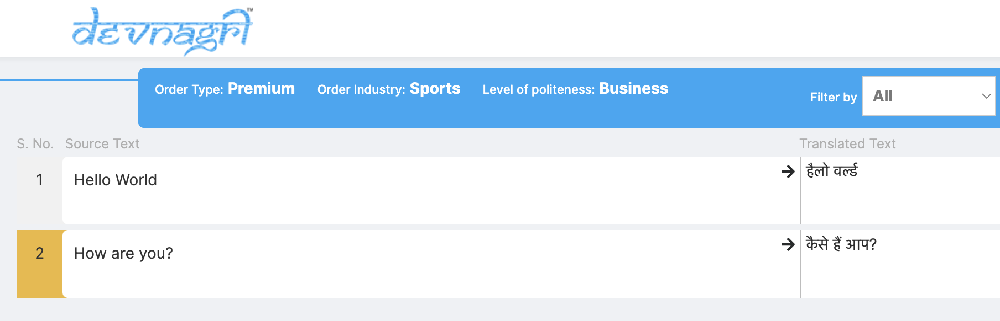

# Devnagri Platform APIs

## API JSON Order: Create

### Request

```curl
curl --location --request POST 'https://app.devnagri.com/api/order/json' \
--header 'Content-Type: application/json' \
--header 'Accept: application/json' \
--data-raw '{
    "api_key": "recgdgstaDKtVpMIJQ",
    "project_name": "Sample Project Name",
    "industry": "sports",
    "source_language": "en",
    "target_language": [
        "hi",
        "bn",
        "gu"
    ],
        "data": [
        {
            "test-123": "Hello World",
            "test-456": "How are you?"
        }
    ]
}'
```

### Response

::: tip SUCCESS
*status code: 200*
:::

```json
{
    "status": "success",
    "code": 200,
    "message": "Order placed successfully.",
    "order_id": "DEV00420"
}
```

::: details NOTES

1. This API is responsible to create order without platform interface using a secret API key.
2. After getting success response from the API, the user can then login to the [platform](https://app.devnagri.com/client/orders), and see the order.
3. In the JSON data (key-value pairs), the keys will be ignored and not be processed for the translation.
    

:::

### Request Parameters

| Key        | Value | Description
| ------------- |:-------------:|:-------------:|
| api_key | SECRET_API_KEY_XXXXX | The key will be provided by the Devnagri and can be found at [Usage Details](https://app.devnagri.com/account/usage) |
| project_name | My Sample Order | Name of the order |
| industry | sports | Type of industry/domain the order belongs to. Use "**Industry Name**" from [here.](Industries.md) |
| source_language | en | Language of the order which needs to be translated **from**. This will be a single value. [Ref.](LanguageCodes.md) |
| target_language | [hi, bn] | Language of the order which needs to be translated **to**. This will be inside an array, can contain more than one language. [Ref.](LanguageCodes.md) |
| data | Your JSON data | A valid JSON object |

---
---

## API JSON Order: Fetch

### Request

```curl
curl --location --request POST 'https://app.devnagri.com/api/order/json-response' \
--header 'Content-Type: application/json' \
--data-raw '{
    "api_key": "recgdgstaDKtVpMIJQ",
    "order_id": "DEV04200"
}'
```

### Response

::: tip SUCCESS
*status code: 200*
:::

```json
{
    "status": "success",
    "code": 200,
    "data": [
        {
            "id": "Thank you. Hi. I'd like to go to the Adelphi Hotel.",
            "hi": "धन्यवाद। हाय। मैं एडलफी होटल में जाना चाहता हूं।"
        },
        {
            "id": "Excuse me. - I'm sorry. This is my cab.",
            "hi": "माफ कीजिएगा। -मैं माफी चाहता हूं। यह मेरी कैब है।"
        }
    ]
}
```

### Response (When translation is not completed)

::: tip SUCCESS
*status code: 200*
:::

```json
{
    "status": "success",
    "code": 200,
    "data": [],
    "message": "Translation not completed."
}
```

### Request Parameters

| Key        | Value | Description
| ------------- |:-------------:|:-------------:|
| api_key | SECRET_API_KEY_XXXXX | The key will be provided by the Devnagri and can be found at [Usage Details](https://app.devnagri.com/account/usage) |
| order_id | DEV04200 | Unique Order Code |

---
---

### Request (V2)

```curl
curl --request POST \
  --url https://app.devnagri.com/api/order/json-response \
  --header 'Content-Type: application/json' \
  --data '{
    "api_key": "recgdgstaDKtVpMIJQ",
    "order_id": "D15303",
    "version": "v2"
}'
```

### Response

::: tip SUCCESS
*status code: 200*
:::

```json
{
    "status": "success",
    "code": 200,
    "data": [
        {
            "id": "Please proceed with questionare part or retry face capture.",
            "hi": "कृपया क्वेश्चन पार्ट के साथ आगे बढ़ें या फ़ेस कैप्चर करने की फिर से कोशिश करें।",
            "pa": "ਕਿਰਪਾ ਕਰਕੇ ਕ੍ਵੇਸਚਨੇਅਰ ਨਾਲ ਅੱਗੇ ਵਧੋ ਜਾਂ ਫੇਸ ਕੈਪਚਰ ਦੀ ਮੁੜ ਕੋਸ਼ਿਸ਼ ਕਰੋ।",
            "bn": "অনুগ্রহ করে  কোয়েশ্চেনিয়ার পার্ট সম্পন্ন করে এগিয়ে যান  অথবা ফেস ক্যাপচারটি পুনরায় চেষ্টা করুন।",
            "ml": "ക്വസ്റ്റിൻനെയർ പാർട്ട് ആയി മുന്നോട്ട് പോകുക അല്ലെങ്കിൽ ഫേസ് ക്യാപ്‌ചർ വീണ്ടും ശ്രമിക്കുക.",
            "sd": "مهرباني ڪري سوال سان اڳتي وڌو حصو يا منهن جي قبضي کي ٻيهر ڪوشش ڪريو.",
        },
        {
            "id": "Please proceed with face capture or retry PAN capture.",
            "hi": "कृपया फ़ेस कैप्चर के साथ आगे बढ़ें या PAN कैप्चर करने की फिर से कोशिश करें।",
            "pa": "ਕਿਰਪਾ ਕਰਕੇ ਫੇਸ ਕੈਪਚਰ ਜਾਂ PAN ਕੈਪਚਰ ਦੀ ਮੁੜ ਕੋਸ਼ਿਸ਼ ਕਰੋ।",
            "bn": "অনুগ্রহ করে ফেস ক্যাপচারের সাথে এগিয়ে যান বা PAN ক্যাপচারটি পুনরায় চেষ্টা করুন।",
            "ml": "ദയവായി ഫേസ് ക്യാപ്‌ചർ ഉപയോഗിച്ച് തുടരുക അല്ലെങ്കിൽ PAN ക്യാപ്‌ചർ വീണ്ടും ശ്രമിക്കുക.",
            "sd": "مهرباني ڪري منهن      سان اڳتي وڌو يا پي اين جي قبضي کي ٻيهر ڪوشش ڪريو.",
        }
    ]
}
```

### Response (When translation is not completed)

::: tip SUCCESS
*status code: 200*
:::

```json
{
    "status": "success",
    "code": 200,
    "data": [],
    "message": "Translation not completed."
}
```

### Request Parameters

| Key        | Value | Description
| ------------- |:-------------:|:-------------:|
| api_key | SECRET_API_KEY_XXXXX | The key will be provided by the Devnagri and can be found at [Usage Details](https://app.devnagri.com/account/usage) |
| order_id | DEV04200 | Unique Order Code |
| version | v2 | |

---
---

## API JSON Order: Reject

This API is responsible to reject the translation for the given sentences in an ongoing order.

> `POST: https://app.devnagri.com/api/order/json/reject`

### Request

```json
{
  "api_key": "recgdgstaDKtVpMIJQ",
  "order_code": "DEV04200",
  "data": {
      "hi": [
        "Hello World",
        "I think that we may safely trust a good deal more than we do.",
        "There's a world of good you could perform."
      ],
      "bn": [
        "Hello World",
        "There's a world of good you could perform.",
        "While he waited at the train station, Joe realized that the train was late."
      ],
      "gu": "Hello World",
  },
  "comment": "Please transliterate. Do not translate."
}
```

> Note: The comment will apply to these sentences only. Please make sure to choose correct translation.

### Response

::: tip SUCCESS
*status code: 200*
:::

```json
{
    "status": "success",
    "code": 200,
    "message": "Order DEV04200 has been sent back for review."
}
```

#### Request parameters

| Key | Sample value | Description
| -------------:|:-------------:|:-------------:|
| api_key | recgdgstaDKtVpMIJQ | Unique key assigned to user for the API usage |
| order_code | DEV04200 | Order Code |
| data  | `{"lang_1": ["sentence_1", "sentence_2"], "lang_2": [...], ...}` | A single sentence or an array of sentences inside language code as key  |
| comment | {Your comment for rejection} | This is an optional field |

---
---

## Translation API

This API is responsible for returning translation for the input sentence.

> `POST: https://app.devnagri.com/api/translate-sentence-api`

### Request

```cURL
curl --location --request POST 'https://app.devnagri.com/api/translate-sentence-api' \
--form 'key="recgdgstaDKtVpMIJQ"' \
--form 'sentence="Hello Devnagri"' \
--form 'src_lang="en"'
--form 'dest_lang="hi"' \
```

### Response

::: tip SUCCESS
*status code: 200*
:::

```json
{
    "translated_text": "हैलो देवनागरी"
}
```

#### Request parameters

The request requires input in the form data

| Key | Sample value | Description |
| -------------:|:-------------:|:-------------:|
| key | recgdgstaDKtVpMIJQ | Unique key assigned to user for the API usage |
| sentence | Hello Devnagri | Input text to be translated |
| src_lang | en | Source language code. [Ref](LanguageCodes.md). |
| dest_lang | hi | Destination language code. [Ref](LanguageCodes.md). |

#### Invalid API Key

::: warning SUCCESS
**status code:** 203 <br>
**error code:** 203

```json
{
    "code": 203,
    "msg": {
        "key": [
            "Invalid key"
        ]
    }
}
```

:::

#### Request validation

::: warning SUCCESS
**status code:** 203 <br>
**error code:** 203

```json
{
    "code": 203,
    "msg": {
        "dest_lang": [
            "The dest lang and src lang must be different."
        ]
    }
}
```

:::

#### Transaction limits reached

::: warning SUCCESS
**status code:** 206 <br>
**error code:** 206

```json
{
    "code": 206,
    "msg": {
        "key": [
            "Your transaction limit has been exceeded. Please contact devnagri support."
        ]
    }
}
```

:::

---
---

## Transliteration API

This API is responsible for returning transliteration for the input sentence.

> `POST: https://app.devnagri.com/api/transliterate`

### Request

```cURL
curl --location --request POST 'https://app.devnagri.com/api/transliterate' \
--form 'input_text="नमस्ते"' \
--form 'src_lang="en"' \
--form 'dest_lang="ml"' \
--form 'key="recgdgstaDKtVpMIJQ"'
```

### Response

::: tip SUCCESS
*status code: 200*
:::

```json
{
    "success": true,
    "at": "2022-06-30 12:20:39.823671 +0000 UTC",
    "input": "namaste",
    "result": "നാമസ്റ് റ്"
}
```

#### Request parameters

The request requires input in the form data

| Key | Sample value | Description |
| -------------:|:-------------:|:-------------:|
| input_text | नमस्ते | Input text |
| src_lang | en |language code. [Ref](LanguageCodes.md). |
| dest_lang | bn | language code. [Ref](LanguageCodes.md). |
| key | recgdgstaDKtVpMIJQ | Unique key assigned to user for the API usage |

#### Invalid API Key

::: warning SUCCESS
**status code:** 203 <br>
**error code:** 203

```json
{
    "code": 203,
    "msg": {
        "key": [
            "Invalid key"
        ]
    }
}
```

:::

#### Request validation

::: warning SUCCESS
**status code:** 203 <br>
**error code:** 203

```json
{
    "code": 203,
    "msg": {
        "dest_lang": [
            "The dest lang and src lang must be different."
        ]
    }
}
```

:::

#### Transaction limits reached

::: warning SUCCESS
**status code:** 206 <br>
**error code:** 206

```json
{
    "code": 206,
    "msg": {
        "key": [
            "Your transaction limit has been exceeded. Please contact devnagri support."
        ]
    }
}
```

:::

---
---

## Transliteration API: Custom

This API is responsible for returning custom transliteration for the input file.
Text between square brackets`[]` will only be transliterated and rest of them will be ignored.

> `POST: https://app.devnagri.com/api/transliterate-custom`

### Request

```cURL
curl --location --request POST 'https://app.devnagri.com/api/transliterate-custom' \
--form 'file=@"/C:/Users/kumar/SampleLyrics.en.txt"' \
--form 'src_lang="auto"' \
--form 'dest_lang="hi"' \
--form 'key="recgdgstaDKtVpMIJQ"'
```

#### Source file content

```txt
Exclusive Upload for StarManch
Aake Teri Baahon Mein
Lyrics: Sameer

[00:04.67]Song: Aake Teri Baahon Mein [End]
[start][undefined][undefined]
[00:07.18]Lyrics: Sameer [End]
[start][undefined][undefined]
[00:09.68]Music: Anand Milind [End]
```

### Response

::: tip SUCCESS
*status code: 200*
:::

```txt
Exclusive Upload for StarManch
Aake Teri Baahon Mein
Lyrics: Sameer

[00:04.67] সং: আঁকে টেরি বাহন মেইন [End]
[start][undefined][undefined]
[00:07.18] লিরিক্স: সমীর [End]
[start][undefined][undefined]
[00:09.68] মিউজিক: আনন্দ মিলিন্দ [End]
```

#### Request parameters

The request requires input in the form data

| Key | Sample value | Description |
| -------------:|:-------------:|:-------------:|
| file | "/C:/Users/kumar/SampleLyrics.en.txt" [Ref](Api.md#source-file-content) | Source File |
| src_lang | auto | This is an optional field, and can be set to "auto". This will detect the language of the `input_text`. language code. [Ref](LanguageCodes.md). |
| dest_lang | ml | language code. [Ref](LanguageCodes.md). |
| key | recgdgstaDKtVpMIJQ | Unique key assigned to user for the API usage |
