# DOTA Mobile App

## Home Page

User needs to go to the Devangri home page and click on Order Translation.

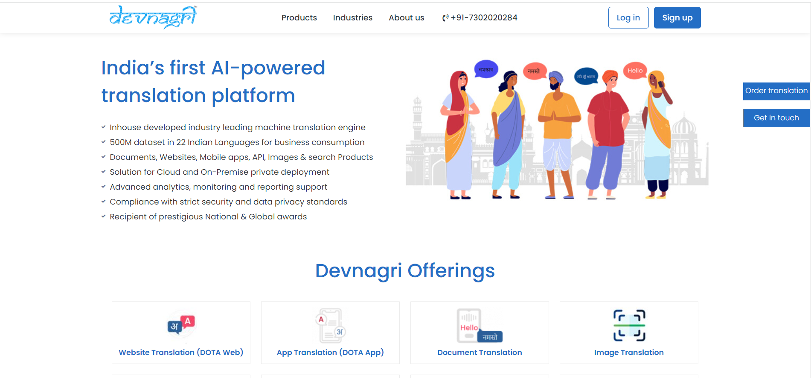

## Login Page

User can Login/Signup from here. User has to provide the login id and password and click on Login.

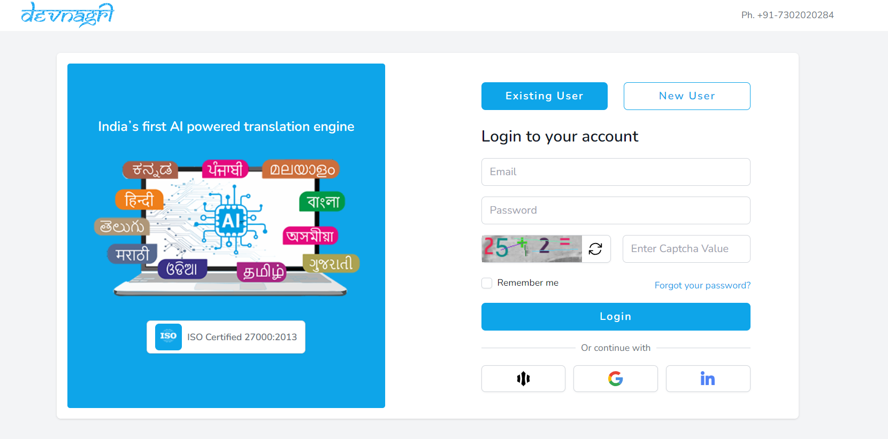

## Dashboard

Go to Mobile Apps on dashboard.

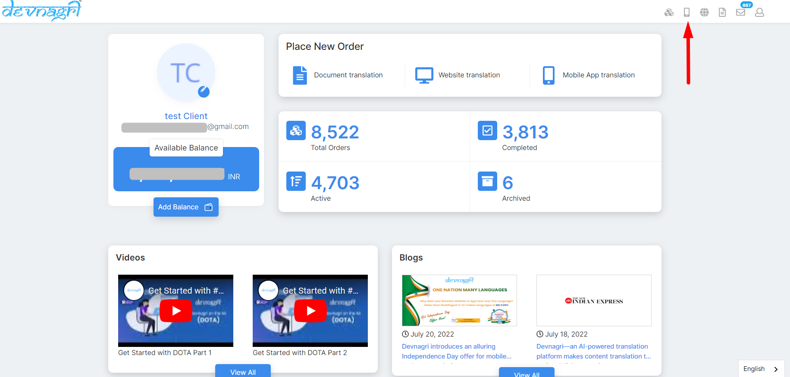

<!-- ## Go to the Mobile Apps list

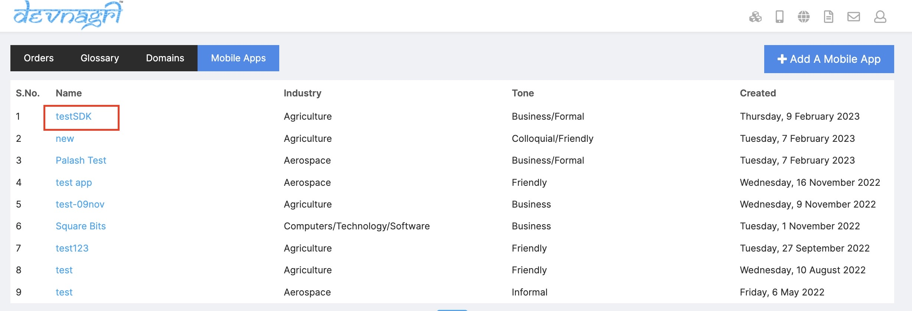 -->

## New order

Click on Add A Mobile App.

## Place order

1. Select the pricing plan.
2. Select the duration.
3. Click on Next Button

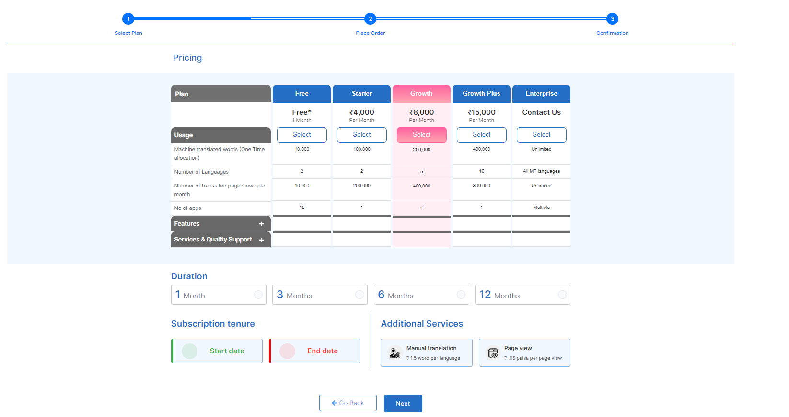

## Order summary

User needs to fill Project Name, Industry, Source Language, Target Languages and click on place order.

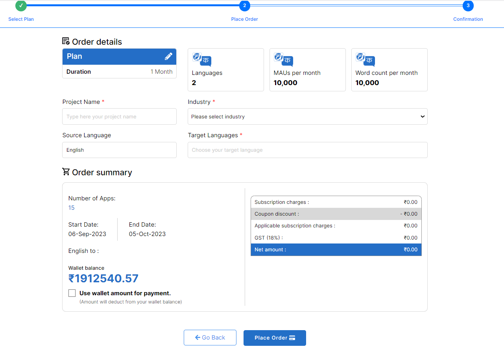

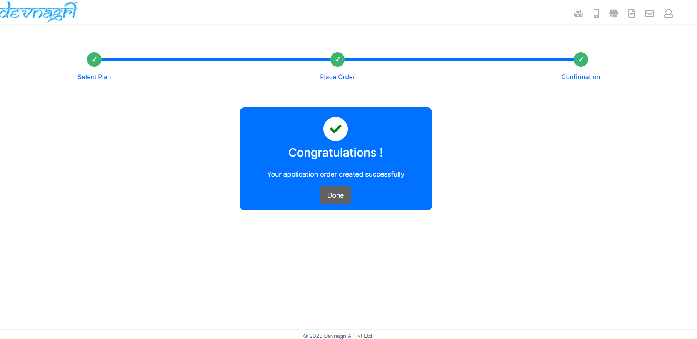
## Details page

Once the order is completed user click on Done button and the page will redirected to Details page which consist

1. Application name.

2. Languages

3. Status

4. Plan

5. Progress

6. Application Expiry date

7. Word count

8. MAU's

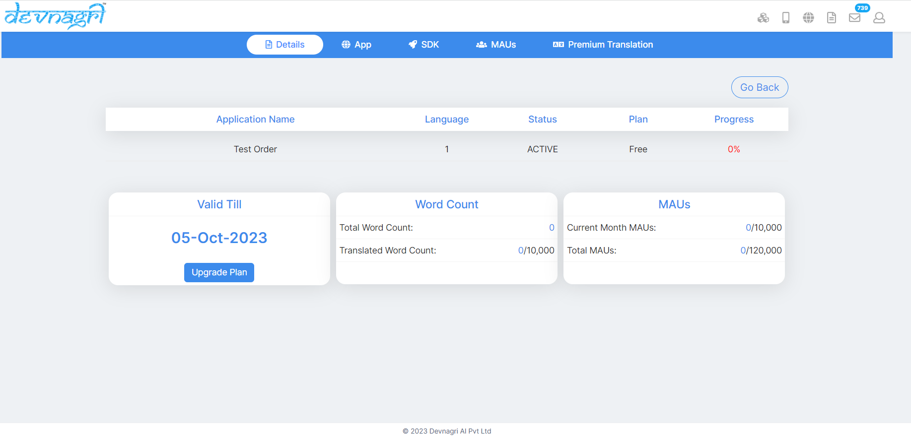

## APP

1. User can add different 15 applications on the App.page upon clicking on the Add app. tab.

2. User can use the Add language drop down button to add languages as per there package.

3. User can see his application mode is live on App.page.

4. User can see the Application names and App key and Bundle ID and phone version on the App.page and status.

5. User can see the Progress,Word count,Translation type,Proof Read.

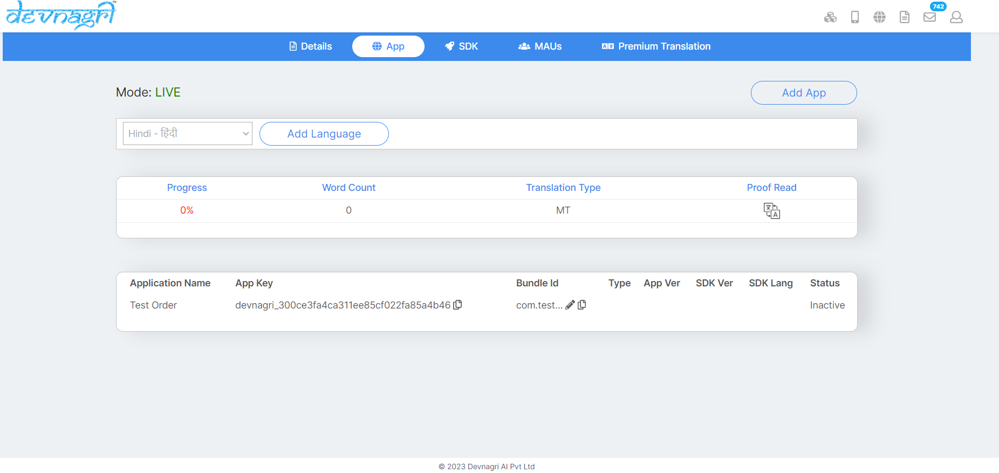.

## Adding Bundle ID

Click on apps to find API key and add Bundle ID
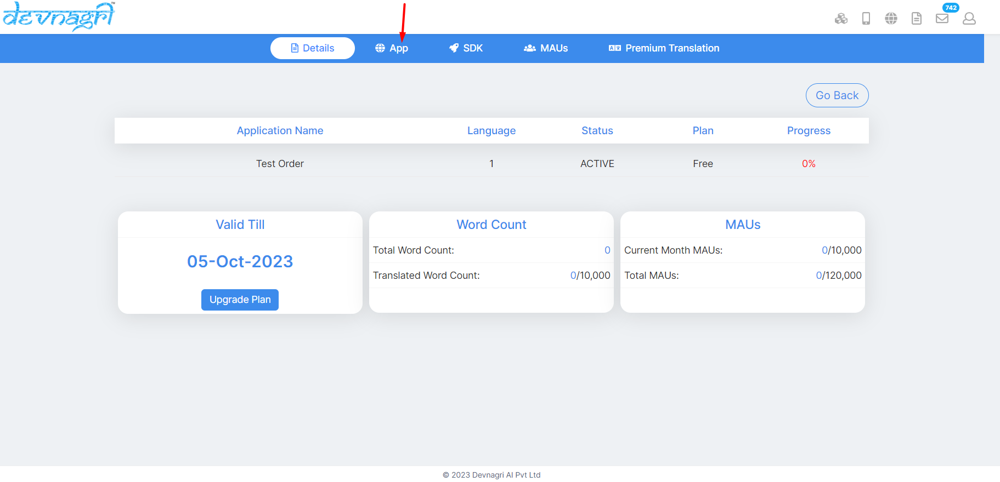

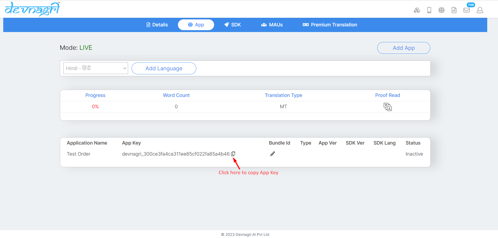

Add generated Bundle Id of your application.

Upon Generating the Bundle ID the user need to enter the Bundle Id in the 'Enter Bundle ID' section

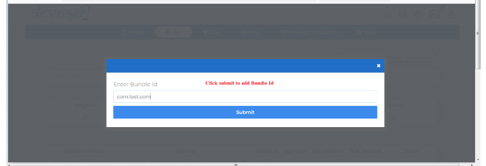

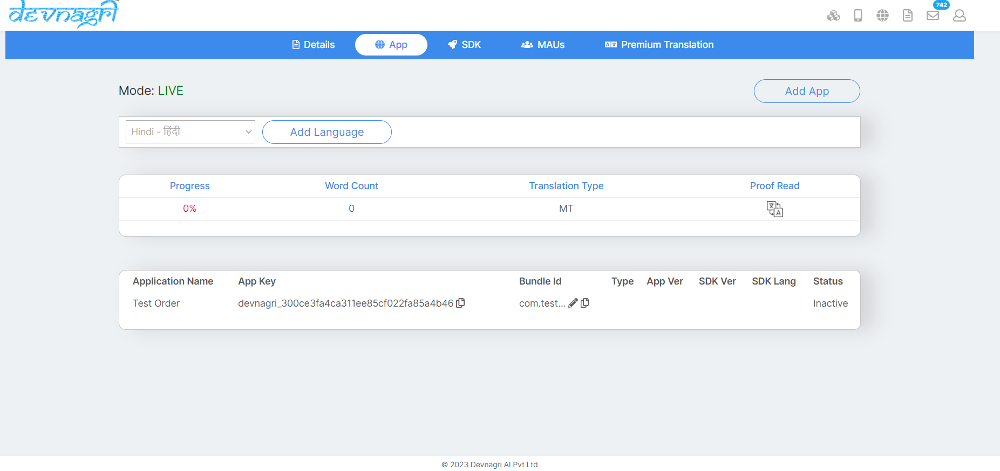

## SDK page

SDK page shows Android SDK-Kotlin/Java and IOS SDK - Swift V2/Objective C.

Note : On SDK page use can use the Test mode tab for testing there application.

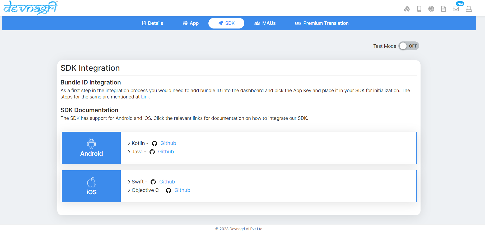

## MAU's (Monthly Active USer)

User can see applicaton Mode,Extra views,Filter,Total pages on the MAU's page.

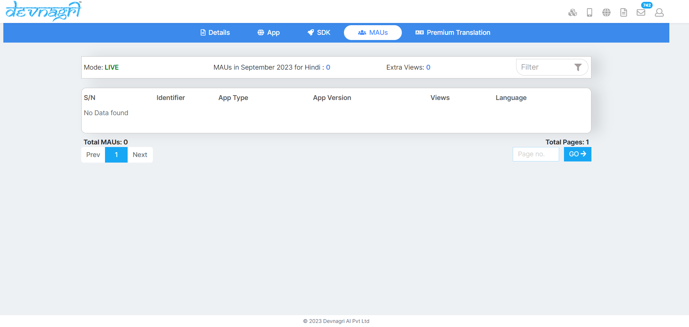.

## Premium translation

User can translate the words to PT by using the PT tab.

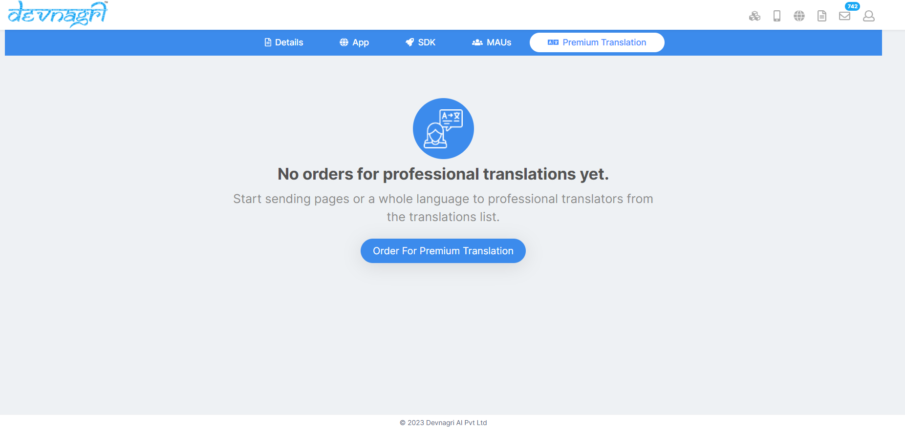
