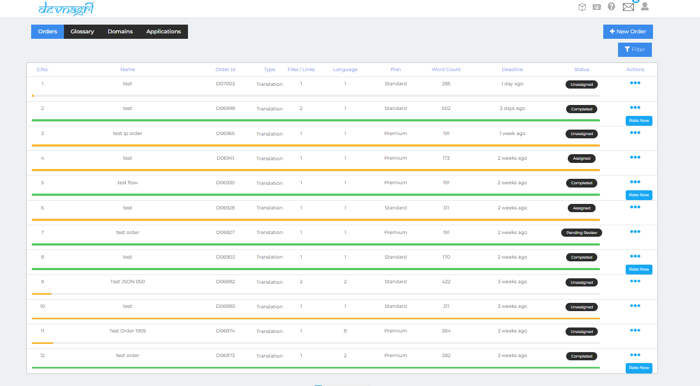
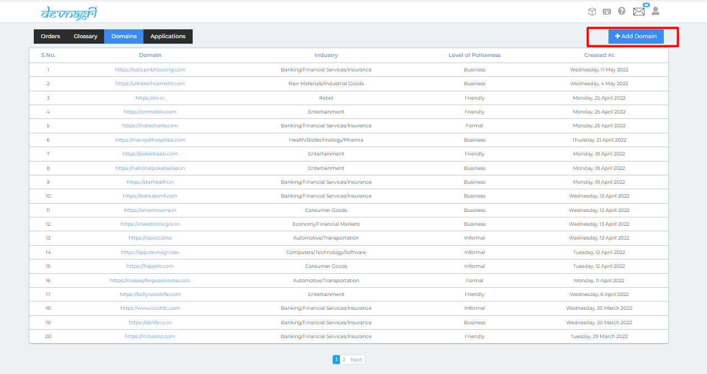
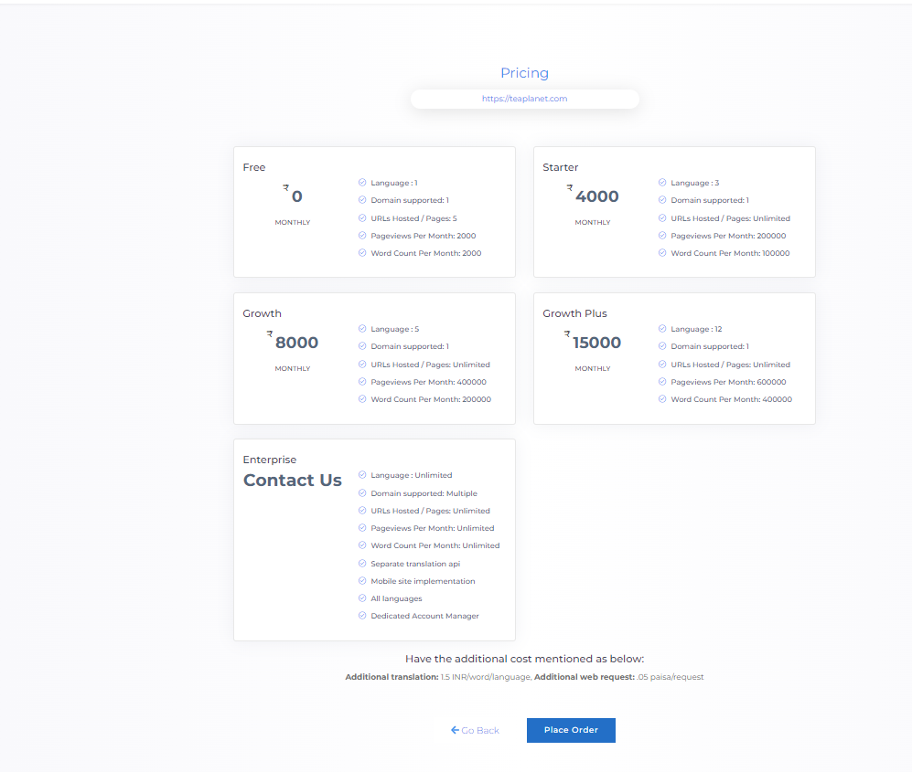
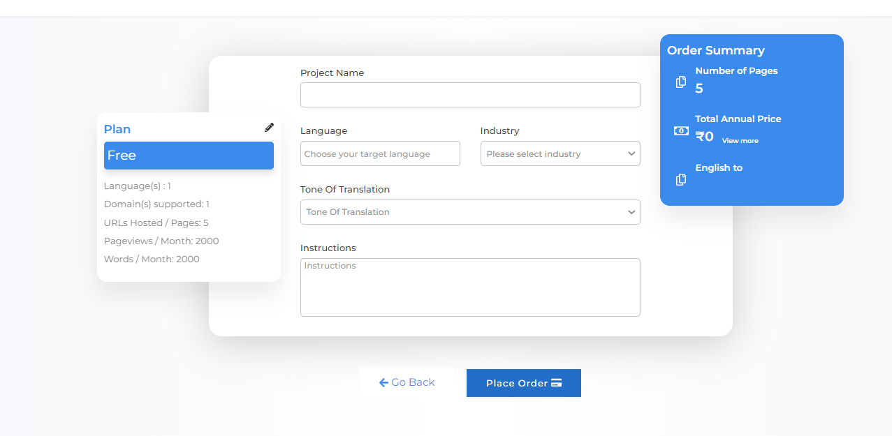
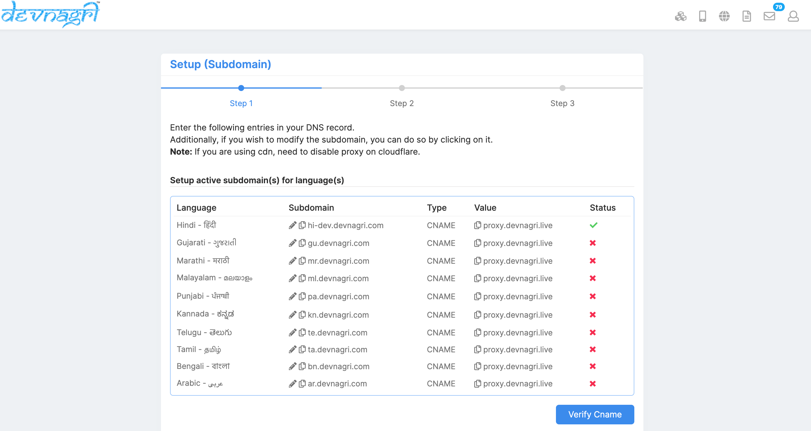
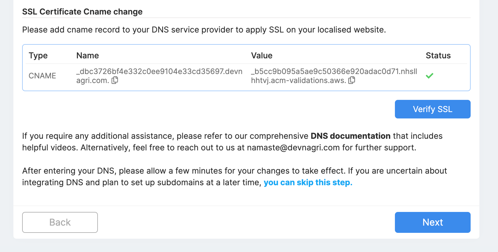
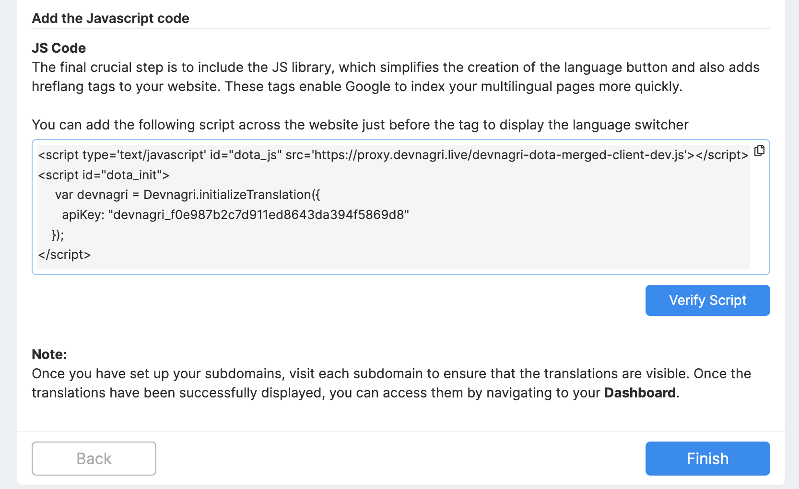
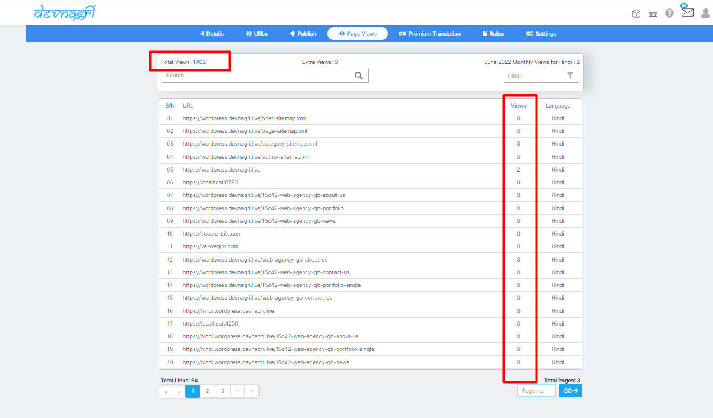
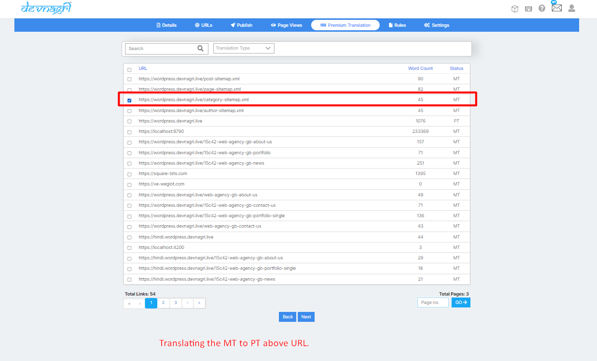
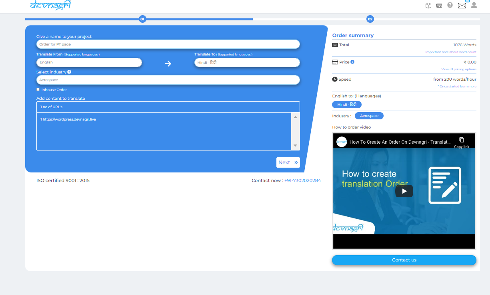

# DOTA Web

Devnagri On the Air is a platform that translates your website on the fly.

The platform enables your website to go multilingual in minutes, without any hassle. You don't need to change anything at the code and infrastructure level. It's just a plug and play solution to go multilingual.

Devnagri On The Air makes your multilingual journey quick and easy.


## Login page

User has to provide the login id and password and click on Log In.


## User Dashboard

User will be taken on his/her dashboard.


## Click on domains

If User wants to translate his website he has to click on the domains button.



## Click on Add domain

User has to click on the Add domain.



## New order on Dota

User has to enter the URL of his website/Domain for translate.


## Pricing Plans

User has to select the pricing plans and click on the place order.



Upon clicking on place order user has to select the plan details and update the project summary details.



## Payment

user will redirected to the payment page and choose any payment method and add the transactions and confirm the order.


Order gets confirmed and page will navigate to the Add Url page.


## Order Confirmation

If existing user has a credits in account the order will get confirmed and it will redirected to Dota dashboard page.

If New user do not have any credits system will redirect to the payment page and it will redirected to the Dota dash board.

## Domain verification

Sign in to your domain name provider and add below TXT record into [DNS Configuration](https://www.youtube.com/watch?v=yQEG62PwVWw).


Click on **verify** and then it will take up few minutes for verification.

## Select approach

1. Subdomain (hi.example.com)
2. Subdirectory (example.com/hi)
3. Live JS (example.com)

### 1. Subdomain

**a.** Please enter the following CNAME entries in your DNS record.

Note: If you are using CDN, you need to disable proxy on Cloudflare.

If you are using GoDaddy or Cloudflare you can see how to do it in the videos below:

[GoDaddy](https://www.youtube.com/watch?v=aoikZ-3PV_8)
<br>

[Cloudflare](https://www.youtube.com/watch?v=Fe1Xnm58lQs)

Click on **Verify Cname** and after verification the red cross should become green tick after a few seconds or minutes.



Devnagri is currently initializing your subdomain(s). Please be patient while the process completes.

**b.** To apply SSL on localised website, add below CNAME record to your DNS service provider. 
Click on **Verify SSL** to verify this step.



**c.** You're welcome to adhere to the guidelines and include the Javascript code snippet immediately before your closing body tag. This will enable the language switcher to appear on your website, as well as add hreflang tags to notify Google of the different variations of the same page and prioritize indexing of these pages. This is particularly beneficial for your SEO efforts.



Once it's done, you can click on **Finish** and you're done!

### 2. Subdirectory

Please ensure you have done a mapping of absolute subfolder (www.yourdomainname/hi/) to proxy.devnagri.com

### 3. Live JS

You're welcome to adhere to the guidelines and include the Javascript code snippet immediately before your closing body tag. This will enable the language switcher to appear on your website.

## Dota Dashboard  

After confirming the order all the URL's will the not download automatically user has to click on add url's.


## Add more URL's

Upon clicking on the add URL's page will redirect to the next page


## URL sync again button

Upon clicking on the Sync again button all the URL's will sync and will display on the screen.


## Translate button

Click on the translate button URL's will be loaded to the Dota dashboard.


## Don't have URL

If system not crawling all the URL's user can click on the click here button and add URL's manually.


## Upload files

User has to update all the URL's in the file and click on the upload button.


## Paste URL's

User can use this tab by pasting individually URL's. to crawl.


## Dota dashboard

User dash boards shows all the details of order.

1. Website name
2. Languages
3. URl's
4. Status
5. Plan
6. Publish
7. Progress
8. Valid till
9. Pages views
10. Word count


## Plan details

User will see the plan details.
ex  Languages,Url's,Plan,Progress,word count,pages view.


## URL tab

## Progress  

If all the URL's translated by system then the progress will show 100% on the dashboard.

## Words

This shows word count - how many words are in the URL.


## Type

This shows translation type of URLs - MT,PT,HT.

### Machine translation

The translation done by machine.

### Human translation

As user want to translate URL him self by using proof read option.  

### Premium translation


## Created On

Shows the date on which the URL was created.

## Updated On

Shows the date on which the URL was updated with some new content.

## Action

### Preview

User can view the translated URL of the particular language.


### Proof Read/Translate

Click on proof read tab.

Proof read shows  all the sentences of the URL along with the translation.

User can also do modification of the sentences.


## Published

Only published links are shown as translated.
We don't translate unpublished URLs.


## Search tab

User can search any URL in the search button.


## Update URL


## Add more language


## Delete tab

We can delete the URL's by using the delete button.


## Change language dropdown filter button

User can see all the progress of the translated URL's

in the particular language.


## Add more URL

If system did not crawl any url due to some technical issue or user want only one particular URL to be translated so user can provide the URL and translate the page.


## Filter button

User can use the filter button to search for Active/Inactive , Translation type, URls.


## Pageview

User can see no.of visitors in the page view.



## Total views

User can see how how many users are visiting his page it will reflect under the total views.

## Extra views

If user current plan exceeds no.of views user has use the pay button for extra views.


## Premium Translation tab

User can see all the Premium translation orders under the PT page

## Order for Premium translation

Upon clicking the upgrade to PT user will redirect to the URLs page and select the URL upon making payment the URL will upgrade to PT.







## Order success

Upon payment success page will redirect to orders page.


## PT orders will reflect on orders page and PT

The list of PT orders will shown under orders page as type DOTA and Premium translation page of DOTA dashboard.


## Translate button


## Translate page

In this page user can see many option and toggle button.

Order type,

Order Industry,

Level of Politeness.

Sorting.

Jump to segment.

Language.

Link.

Duplicate words.

No.of words contain in the page.


## Toggle button

Upon clicking on toggle button the toggle will hide all the button on the page


## Keyboard shortcuts


## Instructions


## Font

Font size can increase and decrease with this button.


## Description on translate page

## Save translation

If User/translator want to save a particular sentence after any changes in sentence they will click on the save translation button.


## Reject

If user do not want to work on the sentence user/translator can click on the reject button.


## Save translations in single click/actions

If user want to save all sentence at single time user has to click on action and select accept all.


## Revision history


## Add comment

User can add comment to translator on the sentence.


## Sort by

User can sort all the sentence by using the sort by option.


## Jump to segment

User can enter any S.no in the search button and click on go button the S.no. will jump to that number on the page.


## Settings

### Caching

#### Custom Purge

##### URL's Purge

Used to purge the cache of URLs. <br>
Limit - 5 URLs at a time, one per line.

##### Folder/Prefix Purge

Used to purge all the URLs of mentioned folder. <br>
Limit - One folder at a time.

#### Domains

Purge all cached files of domains.

#### Purge Settings

Purge settings data so that changes done for the localised website get reflected.

### Merge and Block

#### Merge Folder(s)

To merge msite or amp folders so that they do not show up repeatedly in the system. <br>
Please add comma seprated folder names. eg:- amp,msite etc.

#### Blocked Keyword(s)/URL(s)

For preventing blocked URLs to store in system. <br>
Please delete the malformed URLs once after adding them in the block list.

#### Exclude Block

Mention class or div that you do not want to translate.

### Robots.txt

Please check the syntax and ensure you upload correct robots.txt.

### Object Mapping

An image on the main site will be replaced by the localised image by providing the URLs of the images.

- English URL -  has the image url of the main site.
- Language - select the localised language.
- Localised URL - has the image url that is to be put on the localised site.

Note:- This feature can be used for images, docs, ppts etc.


### Iframes

Specify iframe IDs that you want to localise. <br>
Limit - Mentioned iframes should exist across the site.
Please add comma separated iframe ids, for eg:- iframeid1, iframeid2 etc.

### Hreflang Tags

Please add hreflang tags in your source code. These tags let Google know you have different versions of the same page and favor indexing of these pages. You can find these hreflang tags in the head tag of your website source code.
Note that with this method, you don't need to edit your sitemap.

## Publish

enable translation for the domain.

## Language switcher

User can add the following script to your website to display the language switcher on your website.

User needs to click on the copy button. JS script will be copied to the clipboard. You would need to put this JS code across your website (preferably in a GTM container).


## Custom CSS

You can add Custom CSS for Native Language Switcher Dropdown
Recommendation: Please use combination of (right and bottom) or (left and bottom) and rest field is empty for better dropdown position.

## Settings

Language dropdown on your website
Recommendation : if you are using custom dropdown, please disable both the options.

## Enable Subdomain Redirect

If you are using Devnagri language dropdown, you need to "ON" the settings. This will help you populating a dropdown on your proxy website. This option will work only after you have added the cname successfully.
Recommended: if you are not using your default language dropdown.

## Enable Language Dropdown UI

This settings help you populate an automatic language dropdown on your proxy website.

## Enable Static Content Website

This settings for if your website has static content then enabling this would speed up the content localisation.

## Subdomain

You can active subdomains for language with the Cname.


## Rule

 Some words which never translate or translate as given words.


## Never translate

If User do not want to translate any word we should create a rule upon updating never translate button.


## Always translate  

If User wants to translate any particular word he can create a rule for always translate.


## Purge Cache

### 1. Clear cache of a single url

> **POST 'https://dota-web-api.devnagri.com/api/purge-cache-url'**

```json
{
    "api_key" : "abcdefghijk_xxx",
    "url" : "https://fourtek.com/"
}
```

#### Request parameters

The request requires input in the json data

| Key | Sample value | Description |
| -------------:|:-------------:|:-------------:|
| api_key | abcdefghijk_xxx | API Key |
| url | "https://fourtek.com/" | URL for purging |

### 2. Clear cache of complete domain

> **POST 'http://localhost:8081/api/purge-cache-url'**

```json
{
    "api_key" : "abcdefghijk_xxx",
    "isDomainWise" : true
}
```

#### Request parameters

The request requires input in the json data

| Key | Sample value | Description |
| -------------:|:-------------:|:-------------:|
| api_key | abcdefghijk_xxx | API Key |
| isDomainWise | true | This as **true** will purge the complete domain for this API key |
