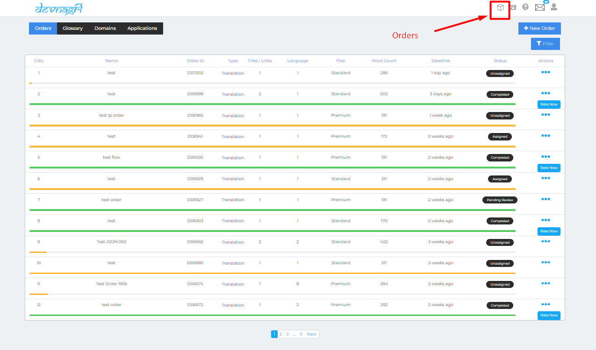
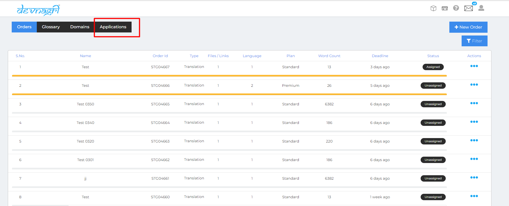
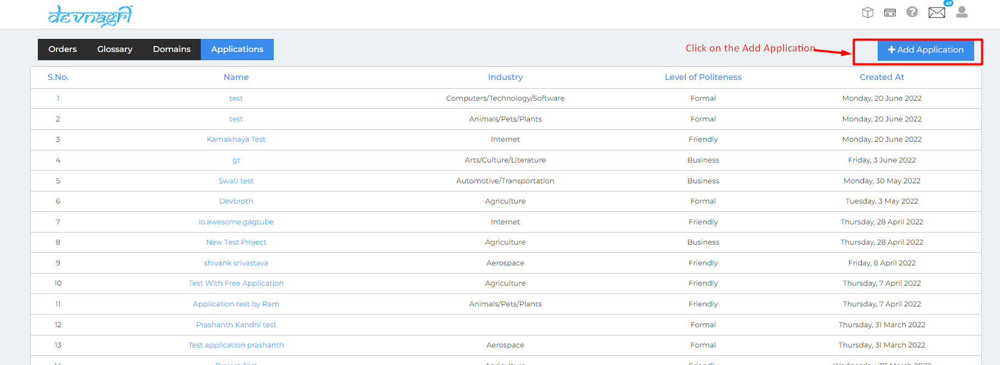
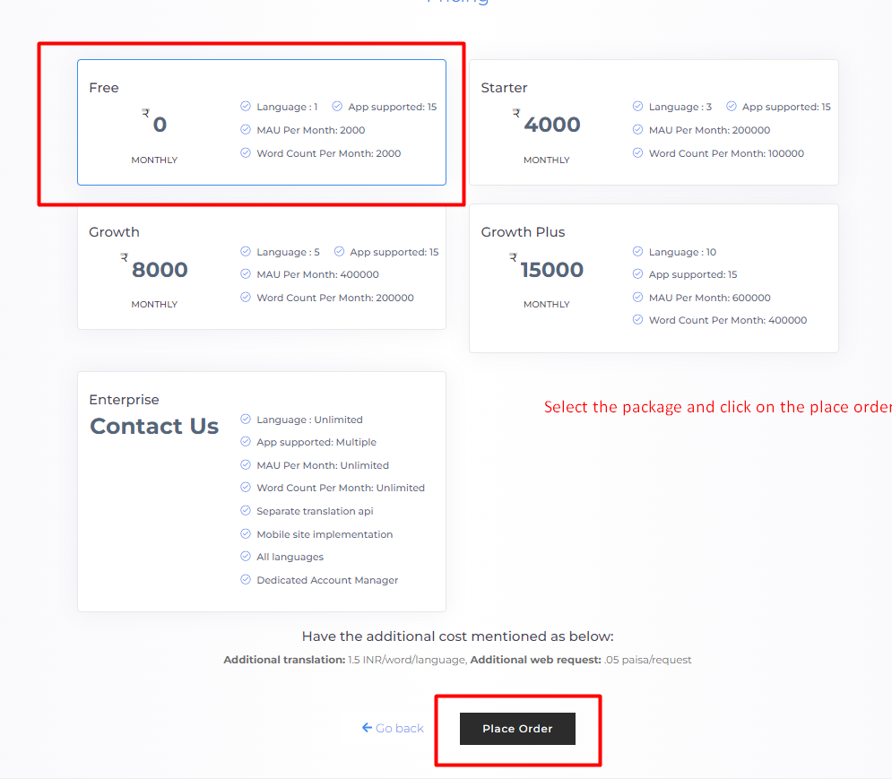
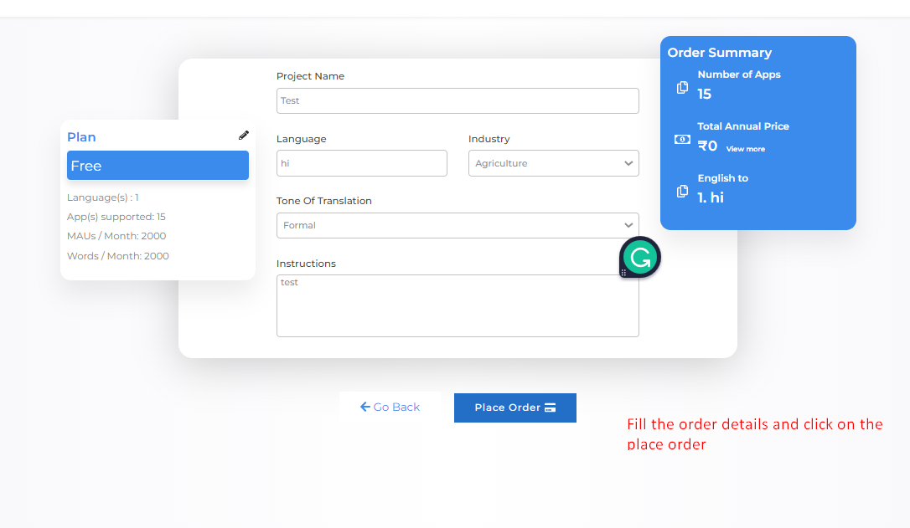
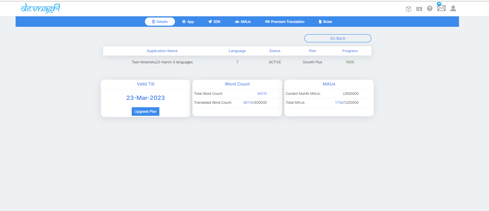
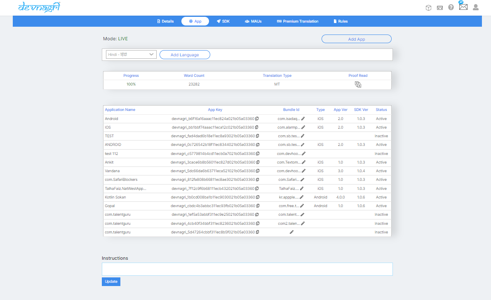
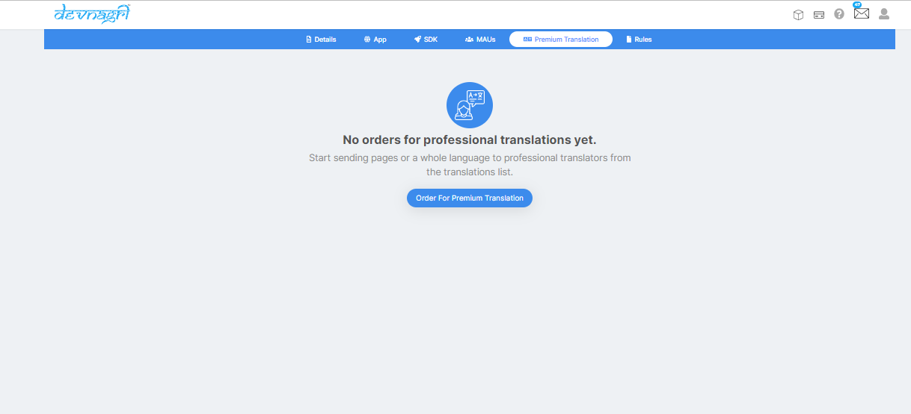

# Login

User needs to go to the Devangri home page.

## User needs to click on the order online

1) Click on the Login/Signup.

## Sign-in page

User has to provide the login id and password and click on sign-in.

## Orders page

Users orders will reflect on the orders page.

## Go to the Appllication list

## New order

Click on the add application on applications tab.

## Add Application and place order

User need to click on the add application and place order.

## Order summary

User needs to fill Project name, Language, Industry,Tone of translation, Instruction and click on place order.

## SDK page

Once the order is completed the page will redirected to SDK page which shows Android SDK-Kotlin/Java and IOS SDK - Swift V2/Objective C.

Note : On SDK page use can use the Test mode tab for testing there application.

## Details page

Details page consists.

1) Application name.

2)Languages

3)Status

4)Plan

5)Progress

6)Application Expiry date

7)Word count

8 )MAU's

## APP

1 ) User can add different 15 applications on the App.page upon clicking on the Add app. tab.

2 ) User can use the Add language drop down button to add languages as per there package.

3)User can see his application mode is live on App.page.

4 ) User can see the Application names and App key and Bundle ID and phone version on the App.page and status.

5 ) User can update instructions on App.page.

6 ) User can see the Progress,Word count,Translation type,Proof Read.

.

## MAU's (Monthly Active USer)

User can see applicaton mode,Extra views,Filter,Total pages on the MAU's page.

.

## Premuim translation

User can translate the words to PT by using the PT tab.

## Rule

 Some words which never translate or translate as given words.

## Never translate

If User do not want to translate any word we should create a rule upon updating never translate button.

## Always translate  

If User wants to translate any particular word he can create a rule for always translate.

