# DOTA

Devnagri On the Air is a platform that translates your website on the fly.

The platform enables your website to go multilingual in minutes, without any hassle. You don't need to change anything at the code and infrastructure level. It's just a plug and play solution to go multilingual.

Devnagri On The Air makes your multilingual journey quick and easy.

# User login

If user has a existing account click on already login.
If new user click on not login button.

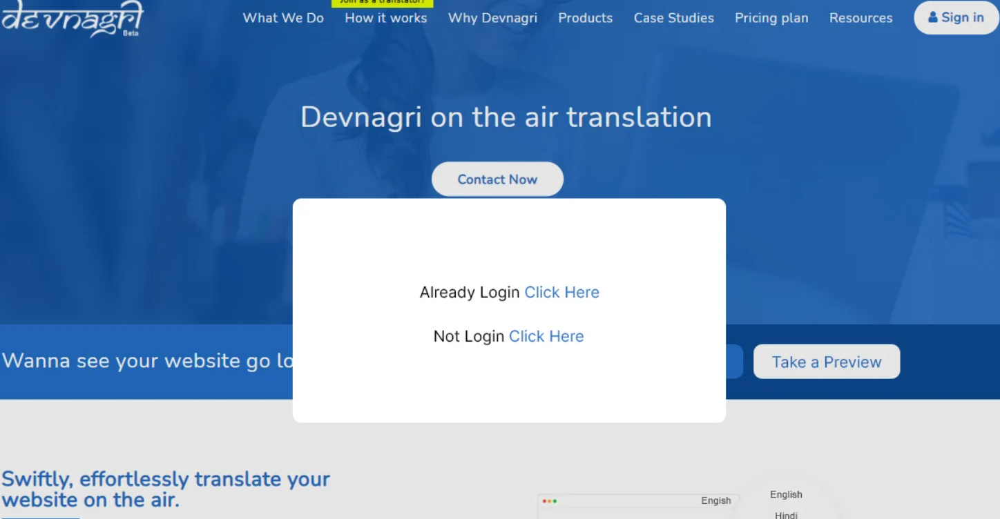

# Sign-in page

User has to provide the login id and password and click on sign-in.

# Orders page

Users orders will reflect on the orders page.

# Click on domains

If User wants to translate his whole website he has to click on the domains button.

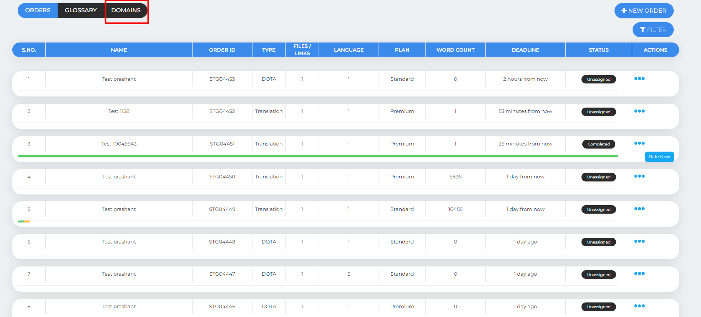

# Click on Add domain

User has to click on the add domain.

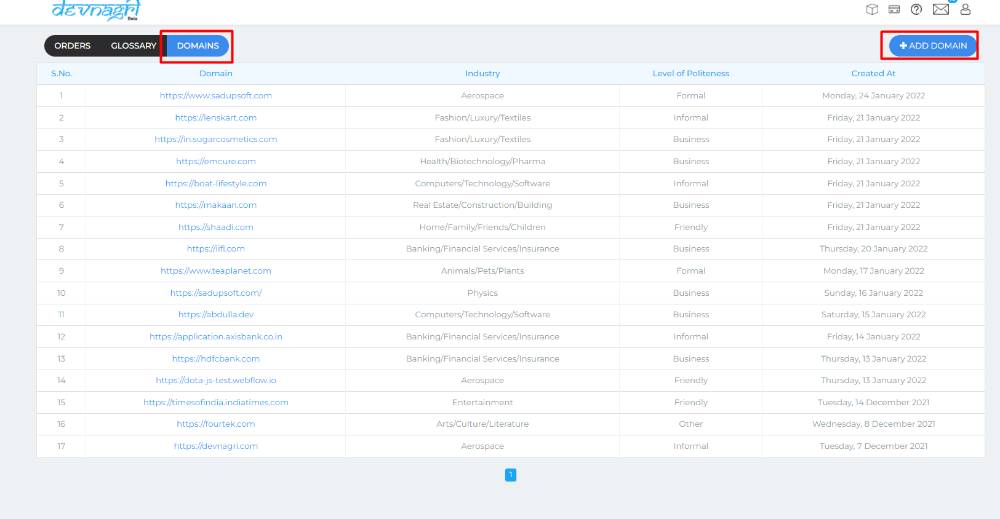

# New order on Dota

User has to click on orders and enter the URL of his website/Domain for translate.

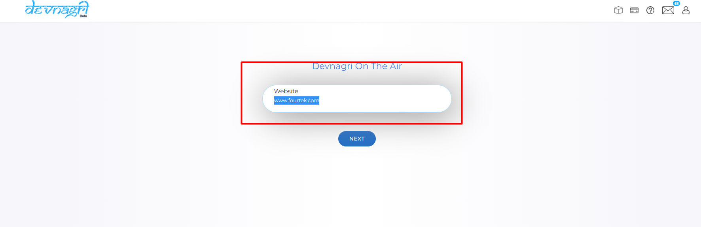

# Package/Plans

User has to select the package/plans and click on the place order.

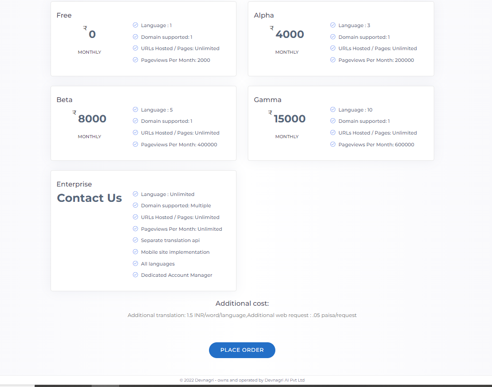

Upon clicking on place order user has to select the plan details and update the project summary details.

# payment

user will redirected to the payment page and choose any payment method and add the transactions and confirm the order.

Order gets confirmed and page will navigate to the Add Url page.
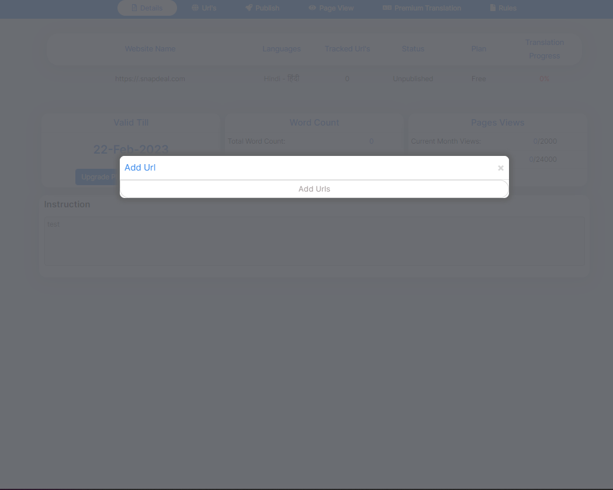

# Order confirmation

If existing user has a credits in account the order will get confirmed and it will redirected to Dota dashboard page.

If New user do not have any credits system will redirect to the payment page and it will redirected to the Dota dash board.

# Dota dashboard  

After confirming the order all the URL's will the not download automatically user has to click on add url's.

# Add more URL's

Upon clicking on the add URL's page will redirect to the next page

# URL sync again button

Upon clicking on the Sync again button all the URL's will sync and will display on the screen.

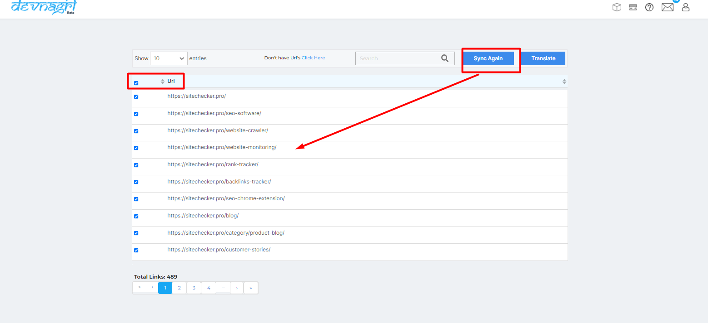

# Translate button

Click on the translate button URL's will be loaded to the Dota dashboard.

# Don't have URL(Click here)

If system not crawling all the URL's user can click on the click here button and add URL's manually.

# Upload files

User has to update all the URL's in the file and click on the upload button.

# Paste URL's

User can use this tab by pasting individually URL's. to crawl.

# Dota dashboard

User dash boards shows all the details of order.

1. website name
2. Languages
3. URl's
4. Status
5. Plan
6. Publish
7. Progress
8. Valid till
9. pages views
10. Word count

# Plan details

User will see the plan details.
ex  Languages,Url's,Plan,Progress,word count,pages view.

# URL tab (explain in details)

# Progress  

If all the URL's translated by system the progress will show 100% on the dashboard.

# Word count

The word count shows how many words are in the URL.

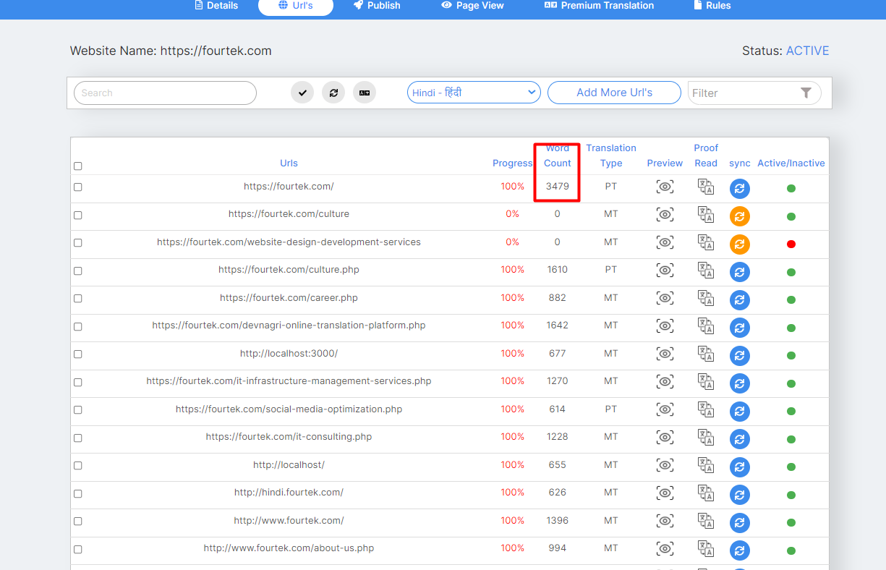

# Translation type

Under the translation type system shows the URL is MT,PT,HT.

# Machine transalte

The translation done by machine.

# Human translation

As user want to translate URL him self by using proof read option.  

# Premium translation

# Preview

User can view the translated URL of the particular language.

# Proof read/Translate

Click on proof read tab.

Proof read shows  all the sentences of the URL along with the translation .

User can also do modification of the sentences.

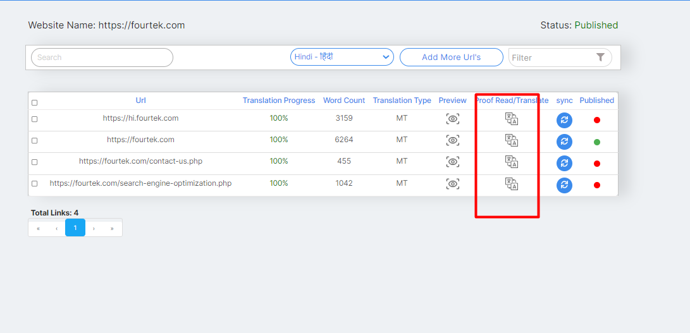

# Sync

If any updates/changes in the URL or progress is not 100 per.then user can use sync button.

It will scrap and update the content of the URL again.

# Active/Inactive

Active  If user click on the active button the user will see translated page will be shown.

Inactive  If user click on the inactive button the user will see the URL always in  source language (English).

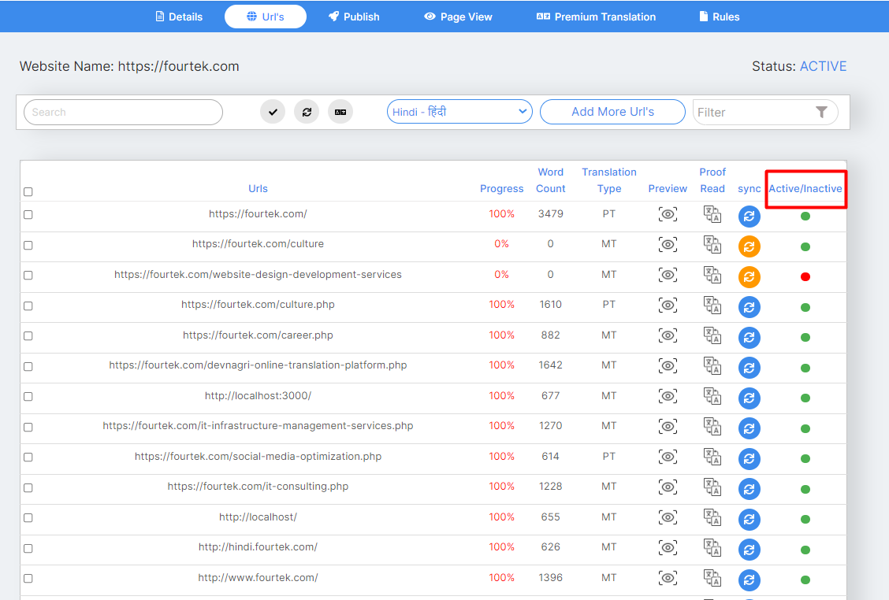

# Search tab

User can search any URL in the search button.

# Update URL

# Add more language

# Change language dropdown filter button

User can see all the progress of the translated URL's

in the particular language.

# Add more URL

If system did not crawl any url due to some technical issue or user want only one particular URL to be translated so user can provide the URL and translate the page.

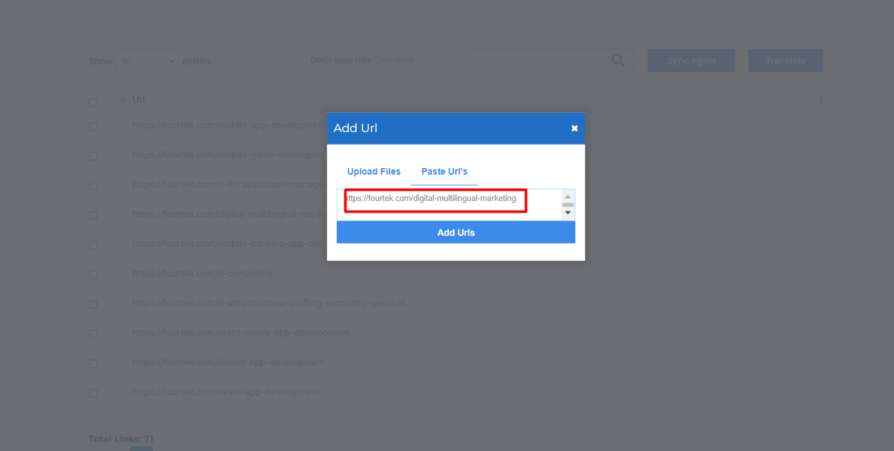

# Filter button

User can use the filter button to search for Active/Inactive , Translation type, URls.

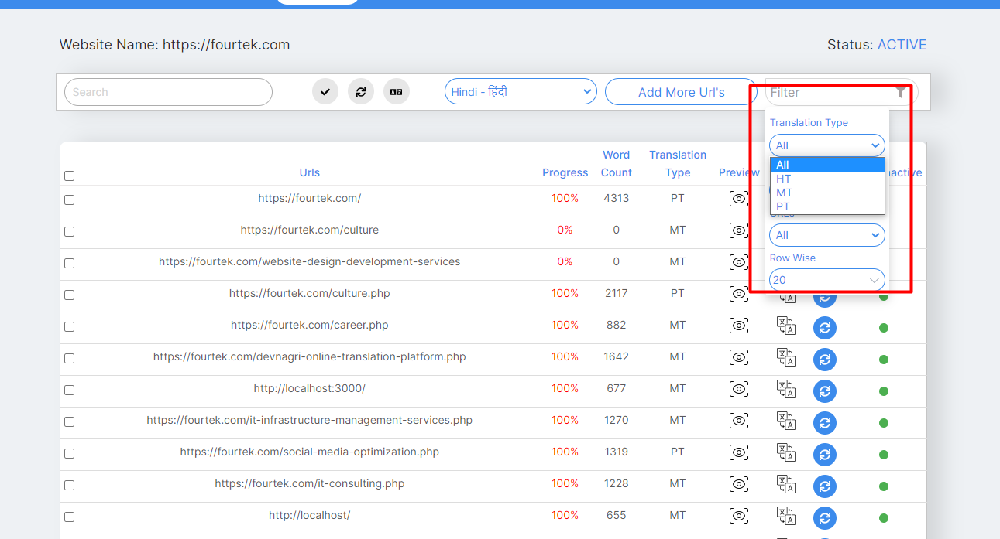

# Pageview

User can see no.of visitors in the page view.

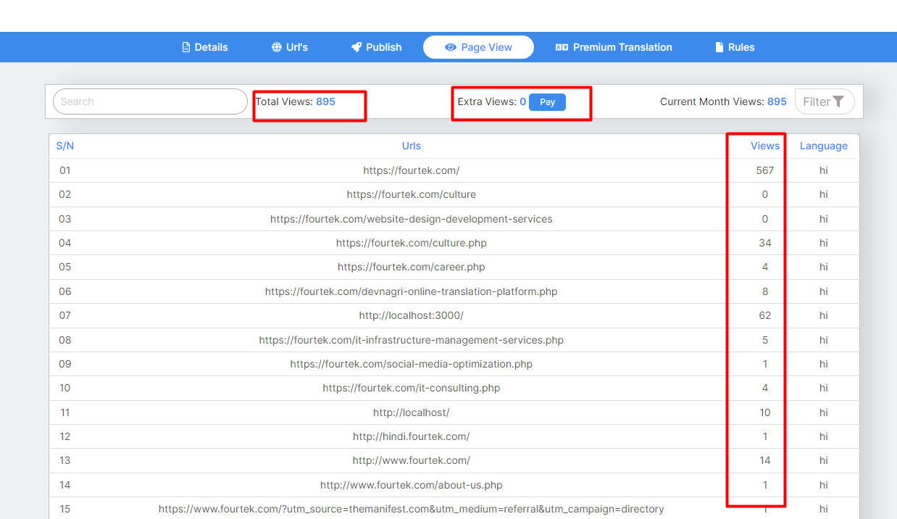

# Total views

User can see how how many users are visiting his page it will reflect under the total views.

# Extra views

If user current plan exceeds no.of views user has use the pay button for extra views.

# Premium Translation tab

User can see all the Premium translation orders under the PT page

# Order for Premium translation

Upon cliking the upgrade to PT user will redirect to the URLs page and select the URL upon making payment the URL will upgrade to PT.

# check the flow and update oe more image

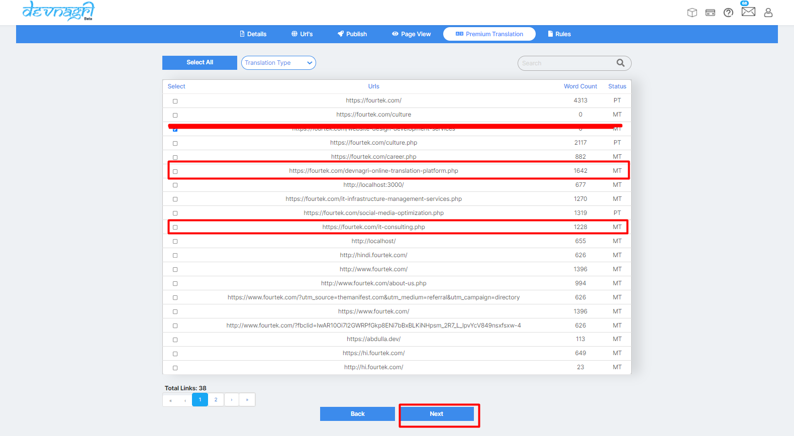

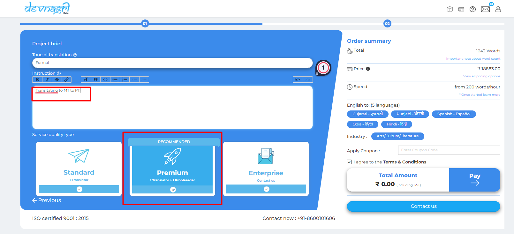

# Order sucess

Upon payment success page will redirect to orders page.

# PT orders will reflect on orders page and PT

The list of PT orders will shown under orders page as type DOTA and Premium translation page of DOTA dashboard.

# Translate button

# Translate page

In this page user can see many option and toggle button.

Order type,

Order Industry,

Level of Politeness.

Sorting.

Jump to segment.

Language.

Link.

Duplicate words.

No.of words contain in the page.

# Toggle button

Upon clicking on toggle button the toggle will hide all the button on the page

# Keyboard shortcuts

# Instructions

# Font

Font size can increase and decrease with this button.

# Description on translate page

# Save translation

If User/translator want to save a particular sentence after any changes in sentence they will click on the save translation button.

# Reject

If user do not want to work on the sentence user/translator can click on the reject button.

# Save translations in single click/actions

If user want to save all sentence at single time user has to click on action and select accept all.

# Revision history

# Add comment

User can add comment to translator on the sentence.

# Sort by

User can sort all the sentence by using the sort by option.

# Jump to segment

User can enter any S.no in the search button and click on go button the S.no. will jump to that number on the page.

# Publish

enable translation for the domain

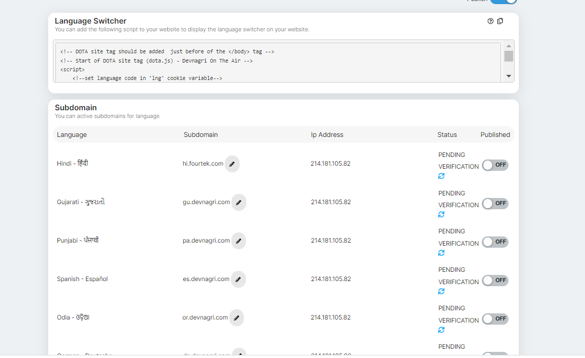

# Rule

 Some words which never translate or translate as given words.

# Never translate

If User do not want to translate any word we should create a rule upon updating never translate button.

# Always translate  

If User wants to translate any particular word he can create a rule for always translate.

